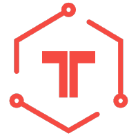
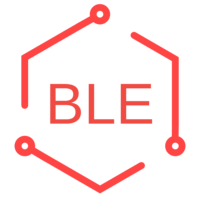
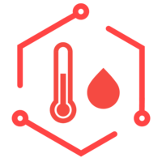
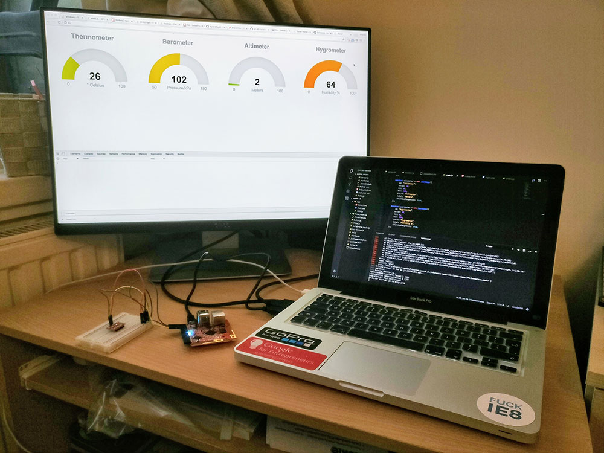

# IoT Development on Tessel2 Development Platform

This reporsitory is a collection of basic IoT projects made with a **Tessel 2** board with **Expantion Pack**, **Climate and Motion Sensor** and **Bluethooth Mod**.

You can find examples of project combining leds and sensors and a dinamic user interface.

I am currently working on a **smart home platform** using several devices (*Tessel 2, Onion Omega 2, Raspberry Pi 3 Model B*). However, the repository is currently private.

